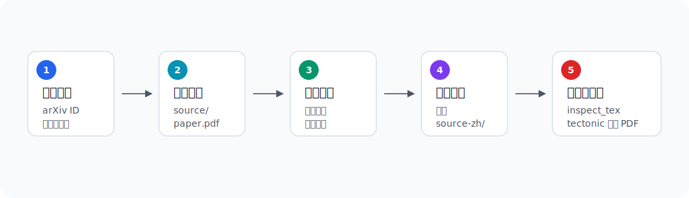
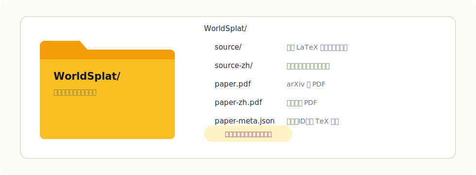

# arxiv-paper-zh

新论文很多，英文读得再顺，也不如母语来得省劲。  
这个 Skill 做的事情很简单：把 arXiv 论文的 LaTeX 源码和原 PDF 拉下来，单独复制出一份中文源码，再用本地 `tectonic` 编译成中文 PDF。

如果你想要的不是“看个大概”，而是一份**排版正常、公式引用不乱、后续还能继续改**的中文版论文，它会比直接翻 PDF 更合适。



## 它适合谁

适合这几种情况：

- 你想把 arXiv 论文翻成能认真阅读的中文 PDF。
- 你不想改坏原始源码，希望中英两份源码分开放。
- 你希望译文是可以继续校对、继续修的 `.tex`，而不只是一次性的 PDF。
- 你更在意翻译质量和可复核性，而不是“几分钟自动出结果”。

它的产物会长这样：



```text
papers/WorldSplat/
  source/          # 原始源码
  source-zh/       # 中文源码
  paper.pdf        # 原论文 PDF
  paper-zh.pdf     # 中文 PDF
  paper-meta.json  # 标题、arXiv ID、主 TeX 文件
```

## 这个 Skill 会做什么

装好之后，你只需要告诉 Agent 你想读哪篇论文，它会按这个流程做：

1. 下载 arXiv 源码和原始 PDF  
2. 按论文标题建目录，保留 `source/` 原文  
3. 复制出 `source-zh/` 作为中文翻译版本  
4. 先通读全文，再逐段翻译 LaTeX 源码  
5. 扫描疑似漏翻的英文段落  
6. 用本地 `tectonic` 编译出 `paper-zh.pdf`

默认要求是：**不用机器翻译 API，不下载现成译文，先读全文，再逐段自己翻。**

## 安装方式

### 方式一：直接交给 Agent 安装

这是最省心的方式：

```text
请帮我安装这个 Skill：https://github.com/zeya-labs/arxiv-paper-zh
```

### 方式二：手动安装

先 clone 仓库：

```bash
git clone https://github.com/zeya-labs/arxiv-paper-zh.git
```

然后把内层的 skill 目录复制到你的 skills 目录里。以 Codex 为例：

```bash
mkdir -p ~/.codex/skills
cp -R arxiv-paper-zh/arxiv-paper-zh ~/.codex/skills/
```

本地依赖只有这些：

- Python 3.10+
- 能访问 `arxiv.org`
- `tectonic`

## 装好之后怎么用

你可以直接这样说：

- `帮我把 2509.23402 翻译成中文 PDF`
- `翻译这篇 arXiv：https://arxiv.org/abs/2603.17117`
- `把 2601.00051v1 下载到 ./papers，全文翻译成中文，再编译 PDF`
- `翻译 WorldSplat，保留 source 和 source-zh 两套源码`

如果你想明确一点，也可以这样说：

```text
Use $arxiv-paper-zh to download https://arxiv.org/abs/2509.23402 into ./papers, translate the full paper into Chinese paragraph by paragraph, and compile paper-zh.pdf with tectonic.
```

## 它和“直接翻 PDF”有什么不同

直接翻 PDF 的优点是快。  
这个 Skill 走的是另一条路：先处理 LaTeX 源码，再重新编译。

这样做的好处是：

- 公式、引用、编号、多栏排版更稳
- 原文和译文能并排保留，方便对照
- 留下的是可继续修改的中文 `.tex`
- 更适合认真读论文，而不是只看摘要级内容

当然，代价也很直接：它更慢，也更挑论文条件。只有 arXiv 提供 LaTeX 源码的论文，才适合这条流程。

## 说明

这个项目只提供 workflow 和脚本，不分发论文源码、译文或生成的 PDF。  
使用论文内容时，请以论文本身的许可和你的实际使用场景为准。
