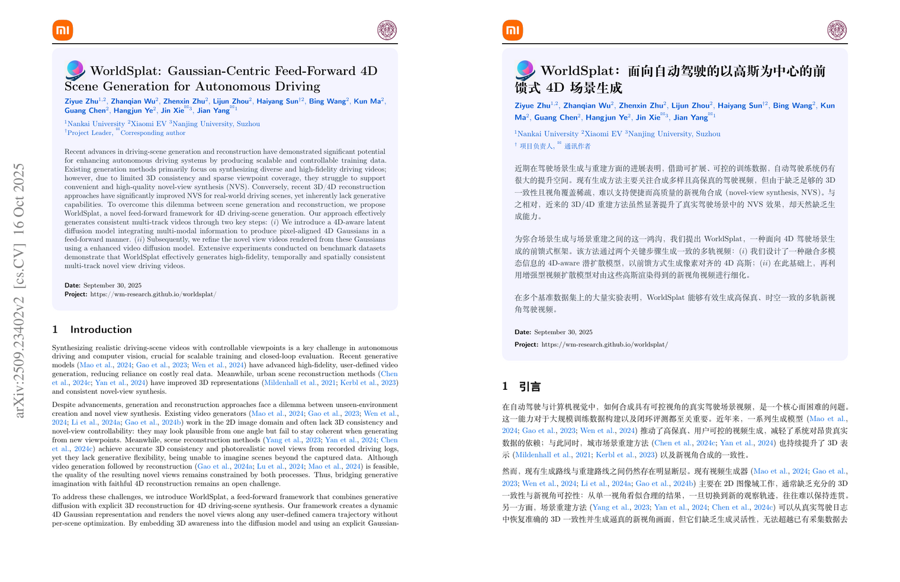
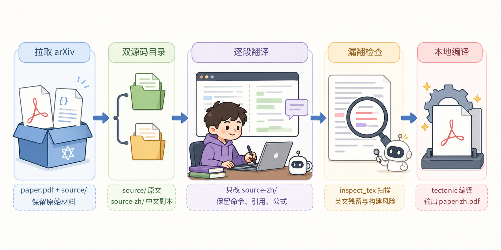

# arxiv-paper-zh

`arxiv-paper-zh` 是一个给 Codex/Agent 用的 Skill。它把 arXiv 论文整理成一份可继续修改、可重新编译、可复核的中文 LaTeX 工作区。

它不是“把 PDF 丢给翻译器”。它的核心思路是：下载 arXiv 源码和原 PDF，保留一份原始源码 `source/`，复制出一份中文源码 `source-zh/`，只在中文源码里逐段翻译，最后用本地 `tectonic` 编译出 `paper-zh.pdf`。

适合你想认真读一篇论文，而不是只想快速看摘要或粗略机翻的时候用。

## 真实产物长什么样

下面的截图来自本工作区里的样例论文 `papers/WorldSplat/`：左边是 arXiv 原 PDF，右边是从 `source-zh/` 重新编译出来的中文 PDF。



这张图想说明三件事：

- 中文版不是覆盖在 PDF 上的临时翻译层，而是重新编译出来的 PDF。
- 标题、摘要、正文这类论文文本会翻译成中文。
- 作者、机构、链接、引用、公式、图表结构等仍然保留原论文的 LaTeX 组织方式。

一个完成后的论文目录通常是这样：

```text
papers/WorldSplat/
  paper.pdf          # arXiv 原 PDF
  paper-zh.pdf       # 编译得到的中文 PDF
  source/            # arXiv 原始 LaTeX 源码，尽量不动
  source-zh/         # 中文 LaTeX 源码，只在这里翻译和修构建问题
```

## 它会做什么

当你让 Agent 使用这个 Skill 翻译论文时，它会按这个顺序工作：



这张图对应的是一次完整任务的主路径：先把 arXiv 的 PDF 和 LaTeX 源码拉下来，再分出 `source/` 与 `source-zh/` 两套目录；翻译时只改中文副本，随后扫描漏翻和构建风险，最后用 `tectonic` 编译出 `paper-zh.pdf`。

1. 下载 arXiv 的源码包和原始 PDF。
2. 按论文标题创建独立目录。
3. 解压源码到 `source/`，再复制一份到 `source-zh/`。
4. 先通读论文，确定术语、方法名、数据集名和引用关系。
5. 在 `source-zh/` 里逐段翻译正文、标题、摘要、章节名、图表说明等可见文本。
6. 保留 LaTeX 命令、公式、标签、引用、文件路径、URL、代码 token 和 bibliography。
7. 扫描 `source-zh/`，找出疑似漏翻的英文段落。
8. 用 `tectonic` 编译中文源码，并把结果同步成 `paper-zh.pdf`。

默认规则是：不调用机器翻译 API，不下载现成译文，不改坏原始 `source/`。

## 仓库里有什么

```text
arxiv-paper-zh/
  README.md                              # 你现在看到的说明
  arxiv-paper-zh/
    SKILL.md                             # Agent 读取的核心工作流
    agents/openai.yaml                   # Skill 在 Agent UI 里的简短描述
    scripts/fetch_arxiv_papers.py        # 下载 arXiv 源码和 PDF
    scripts/inspect_tex.py               # 扫描疑似漏翻英文
    scripts/build_translated_paper.py    # 编译 source-zh 并同步 paper-zh.pdf
    references/troubleshooting.md        # 常见 LaTeX / tectonic 问题
  docs/assets/                           # README 示例截图和示意图
```

安装时真正要复制的是内层的 `arxiv-paper-zh/` Skill 目录，也就是包含 `SKILL.md` 的那一层。

## 什么时候适合用

适合：

- 你要把 arXiv 论文变成能认真阅读的中文 PDF。
- 你希望译文留下 `.tex` 源码，后续还能校对、修改和重新编译。
- 你在意公式、引用、编号、图表和多栏排版尽量保持稳定。
- 你想保留原文源码和中文源码两套目录，方便回头核对。

不适合：

- arXiv 没有提供 LaTeX 源码，只有 PDF。
- 你只需要几分钟内看个大概。
- 你希望完全自动机翻，且不关心后续可维护性。

## 安装

把仓库 clone 下来：

```bash
git clone https://github.com/zeya-labs/arxiv-paper-zh.git
cd arxiv-paper-zh
```

然后把内层 Skill 目录复制到 Codex 的 skills 目录：

```bash
mkdir -p ~/.codex/skills
cp -R arxiv-paper-zh ~/.codex/skills/
```

本地需要：

- Python 3.10+
- 能访问 `arxiv.org`
- `tectonic`

确认 `tectonic` 可用：

```bash
tectonic --version
```

## 怎么用

安装后，你可以直接对 Agent 说：

```text
Use $arxiv-paper-zh to download https://arxiv.org/abs/2509.23402 into ./papers, translate the full paper into Chinese paragraph by paragraph, and compile paper-zh.pdf with tectonic.
```

也可以说得更自然一点：

```text
帮我把 2509.23402 下载到 ./papers，全文翻译成中文，并编译出 paper-zh.pdf。
```

如果只想手动跑下载脚本，可以在仓库根目录执行：

```bash
python arxiv-paper-zh/scripts/fetch_arxiv_papers.py \
  --dest ./papers \
  https://arxiv.org/abs/2509.23402
```

下载完成后，翻译工作应该只发生在对应论文目录的 `source-zh/` 里。

## 内置脚本

这个 Skill 主要带了三个脚本：

- `fetch_arxiv_papers.py`：下载 arXiv 源码和 PDF，创建 `source/` 与 `source-zh/`。
- `inspect_tex.py`：扫描中文源码里疑似漏翻的英文段落。
- `build_translated_paper.py`：用 `tectonic` 编译 `source-zh/`，并刷新顶层 `paper-zh.pdf`。

常用检查命令：

```bash
python arxiv-paper-zh/scripts/inspect_tex.py scan --scope full ./papers/WorldSplat
```

常用编译命令：

```bash
python arxiv-paper-zh/scripts/build_translated_paper.py ./papers/WorldSplat
```

如果主 TeX 文件识别错了，可以显式指定；路径是相对 `source-zh/` 的：

```bash
python arxiv-paper-zh/scripts/build_translated_paper.py \
  --main-tex paper.tex \
  ./papers/WorldSplat
```

## 翻译约定

翻译时优先使用自然、简洁、论文风格的中文。以下内容通常应保持英文或原样：

- 模型名、数据集名、benchmark 名和指标名
- 数学符号、公式、代码标识符和文件路径
- citation key、label、ref、URL
- 已经被社区固定使用的专有名词

可见论文文本则应该翻译，包括标题、摘要、正文、章节标题、图注、表头、列表项和脚注。

## 边界和注意事项

这个仓库提供 workflow、脚本和 Skill 指令，不负责分发论文源码、译文或生成的 PDF。使用论文内容时，请按论文本身的许可和你的实际使用场景处理。

如果 arXiv 源码包里没有 `.tex` 文件，这条工作流就不适用；不要伪造 `source-zh/`。如果中文编译失败，优先在 `source-zh/` 的主文件里加最小必要的 CJK 支持，而不是改动原始 `source/`。
