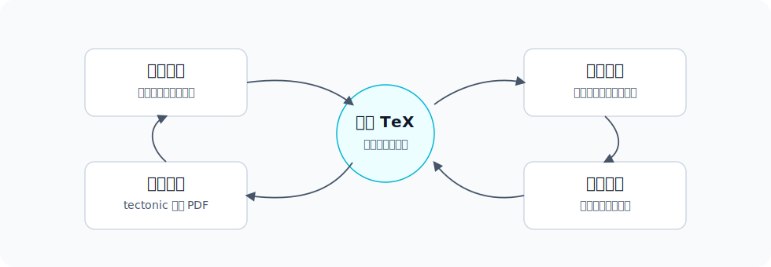

# arxiv-paper-zh

`arxiv-paper-zh` 是一个用于翻译 arXiv LaTeX 论文的 Agent Skill。它做的事情很朴素：把论文源码和原 PDF 下载下来，保留一份原始 `source/`，再复制出一份可以翻译的 `source-zh/`，最后用本地 `tectonic` 编译出 `paper-zh.pdf`。

它不是“把 PDF 丢进去等结果”的工具，更像是给 Agent 准备的一套认真翻译论文的工作台。翻译前先通读全文，术语先对齐，然后逐段改 LaTeX 源码。最后留下的不只是一个中文 PDF，还有一份能继续检查、修改和复用的中文 `.tex`。


## 适合什么场景

如果你只是想快速知道论文大概讲了什么，直接让模型总结 PDF 就够了。

但如果你想得到一份排版正常、公式引用不乱、可以继续校对的中文论文，这个 Skill 会更合适：

- 原文源码不会被改动，方便随时对照。
- 中文译文放在 `source-zh/`，可以像普通 LaTeX 项目一样维护。
- 翻译要求是先读全文，再逐段翻译，不调用机器翻译 API。
- 编译走本地 `tectonic`，不需要把论文源码上传到远程编译服务。
- 翻完后可以扫描疑似漏翻的英文段落，再继续修。

## 产物长什么样

每篇论文会被放进一个按标题命名的文件夹里。结构固定，找东西很直接：


例如：

```text
papers/WorldSplat/
  source/          # arXiv 原始源码，尽量不动
  source-zh/       # 中文翻译源码，只改这里
  paper.pdf        # 原始论文 PDF
  paper-zh.pdf     # 编译出来的中文 PDF
  paper-meta.json  # arXiv ID、标题、主 TeX 文件等信息
```

## 安装

先把仓库克隆到本地：

```bash
git clone https://github.com/zeya-labs/arxiv-paper-zh.git
```

然后把内层的 skill 目录复制到 Codex 的 skills 目录：

```bash
mkdir -p ~/.codex/skills
cp -R arxiv-paper-zh/arxiv-paper-zh ~/.codex/skills/
```

如果你的客户端需要重新加载 skills，重启一下 Codex 或刷新 skill 列表即可。

## 依赖

你需要：

- Python 3.10 或更新版本
- 能访问 `arxiv.org` 的网络
- 已安装并能在命令行里调用的 `tectonic`

可以先检查：

```bash
python --version
tectonic --version
```

## 怎么让 Agent 使用

安装后，你可以直接这样说：

```text
Use $arxiv-paper-zh to download https://arxiv.org/abs/2509.23402 into ./papers, translate the full paper into Chinese, and compile paper-zh.pdf.
```

或者一次处理多篇：

```text
Use $arxiv-paper-zh for 2603.17117 and 2601.00051v1. Keep source and source-zh separate, translate all sections, and build with tectonic.
```

中文也可以：

```text
使用 $arxiv-paper-zh 下载 2509.23402 到 ./papers，先通读全文，再逐段翻译成中文，并用 tectonic 编译出 paper-zh.pdf。
```

## 也可以手动跑脚本

Skill 里的脚本都是普通 Python 脚本，不依赖某个特定对话环境。

下载论文并创建目录：

```bash
python arxiv-paper-zh/scripts/fetch_arxiv_papers.py \
  --dest ./papers \
  https://arxiv.org/abs/2509.23402 \
  2603.17117
```

扫描中文源码里疑似漏翻的英文：

```bash
python arxiv-paper-zh/scripts/inspect_tex.py scan --scope full ./papers/WorldSplat
```

编译中文 PDF：

```bash
python arxiv-paper-zh/scripts/build_translated_paper.py ./papers/WorldSplat
```

如果主 TeX 文件识别错了，可以手动指定：

```bash
python arxiv-paper-zh/scripts/build_translated_paper.py \
  --main-tex main.tex \
  ./papers/WorldSplat
```

## 翻译质量怎么保证

这个 Skill 不承诺“全自动完美翻译”。它真正强调的是一个可检查的过程：



翻译时应该保留 LaTeX 结构、公式、引用、标签、图片路径、BibTeX 信息和代码标识符。模型名、数据集名、指标名、论文名这类标准术语通常也保留英文。真正需要翻译的是论文的叙述、标题、摘要、章节、图表标题、脚注、列表项和可见说明文字。

如果扫描脚本还报出英文，不代表一定有错。它只是提醒你“这里可能还没翻”。剩下的英文如果是专有名词、代码、URL、公式、引用或者数据集名称，就可以保留。

## 和直接翻译 PDF 有什么区别

直接翻译 PDF 很方便，但容易遇到几个问题：公式被拆坏，双栏排版错乱，引用和图表编号变成普通文本，后续想局部修订也不方便。

这个项目绕了一点路：先处理 LaTeX 源码，再重新编译。这样慢一些，但结果更像一篇正常论文，也更容易复核。

## 限制

这个工作流依赖 arXiv 提供 LaTeX 源码。如果某篇论文只有 PDF，或者源码包里没有 `.tex` 文件，就没法沿着这条路径生成可维护的中文源码。

本项目只提供 workflow 和脚本，不分发论文源码、译文或生成的 PDF。请根据论文自身许可和你的使用场景来处理论文内容。

